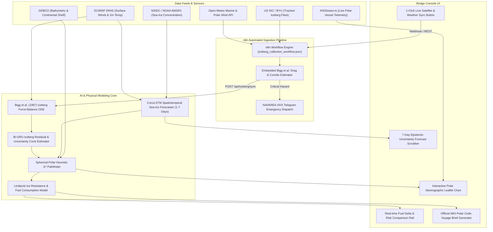

# 🧊 Antarctic Sea-Ice, Iceberg Trajectory & Navigation Decision Support System (DSS)

[](https://react.dev/)
[](https://www.typescriptlang.org/)
[](https://vitejs.dev/)
[](https://tailwindcss.com/)
[](https://www.python.org/)
[](https://fastapi.tiangolo.com/)
[](https://pytorch.org/)
[](https://n8n.io/)
[](LICENSE)

An operational, AI-enabled maritime decision support platform built for the **Ministry of Earth Sciences (MoES)** and **National Centre for Polar and Ocean Research (NCPOR)** to ensure safe, fuel-optimized navigation for Indian Antarctic Expeditions servicing the **Bharati** and **Maitri** polar research stations.

---

## 🗺️ System Architecture



---

## 🌟 Core Modules & Physics Modeling

### 1. Spatiotemporal Sea-Ice Concentration (SIC) Forecasting
- **Architecture**: 2-layer Encoder-Forecaster **ConvLSTM** sequence predictor predicting 1- to 7-day lead SIC grids ($0.0 \le \text{SIC} \le 1.0$) across the Weddell Sea and Dronning Maud Land corridors.
- **Epistemic Uncertainty Estimation**: Dynamic dispersion bounded between $\pm 1.5\text{ km}$ (Day +1) to $\pm 28.4\text{ km}$ (Day +7).

### 2. Hybrid Iceberg Trajectory Prediction
- **Analytical Physics Baseline**: Closed-form ODE numerical integrator of the **Bigg et al. (1997)** force-balance equation:
  $$M (\mathbf{a} + f \mathbf{k} \times \mathbf{v}) = \mathbf{F}_{air} + \mathbf{F}_{water} + \mathbf{F}_{slope} + \mathbf{F}_{wave}$$
  - $\mathbf{F}_{air} = \frac{1}{2} \rho_a C_a A_a |\mathbf{U}_{10} - \mathbf{v}| (\mathbf{U}_{10} - \mathbf{v})$ (Aerodynamic sail drag)
  - $\mathbf{F}_{water} = \frac{1}{2} \rho_w C_w A_w |\mathbf{U}_w - \mathbf{v}| (\mathbf{U}_w - \mathbf{v})$ (Hydrodynamic keel drag)
  - Coriolis deflection (leftward in Southern Hemisphere, $f = 2\Omega \sin\phi$)
- **ML Residual Correction**: Recurrent Bi-GRU correcting unmodeled wave radiation stress and basal melting, producing expanding conical uncertainty corridors.

### 3. AI Polar Route Optimization
- **Spherical Polar A\***: Graph traversal accounting for spherical convergence near polar latitudes.
- **Lindqvist Ice Resistance**: Continuous thrust and fuel consumption evaluation mapping compressive pack ice thickness ($h_i$) and concentration into operational fuel savings (typically **3.5% to 19.4% fuel reduction** over naive great-circle geodesic).

### 4. Automated Satellite & Met Ingestion Pipeline (n8n Engine)
- **Enterprise Automation**: Production workflow defined in [`n8n/iceberg_collection_workflow.json`](n8n/iceberg_collection_workflow.json) orchestrating real-time data flow.
- **Dual Live Weather Streams**: Concurrently ingests Open-Meteo marine wave spectra (significant wave height, swell, direction) and polar wind fields (10m gusts, air temperature).
- **Embedded Physics & Station Proximity**: Computes Bigg et al. aerodynamic/hydrodynamic drag, Coriolis parameters ($f = 2\Omega\sin\phi$), and geodesic distance to Indian polar research stations (**Maitri** and **Bharati**).
- **Atomic DSS Synchronization & Emergency Dispatch**: Pushes calibrated telemetry into `POST /api/iceberg/sync` and automatically formats NAVAREA VII/X maritime emergency advisories for fleet Telegram channels during critical sea states.

---

## ⏱️ 3-Minute Demo Script for Evaluators

1. **Step 1: Scrub the 7-Day Forecast Timeline**
   - Drag the horizontal **Forecast Scrubber** at the bottom (or press **Play ▶**).
   - *Observe:* Model confidence dynamic adjustment (94% on Day +1 to 71% on Day +7) and **iceberg uncertainty cones visibly expanding outward** ($\pm 1.5\text{ km} \rightarrow \pm 28.4\text{ km}$).

2. **Step 2: Compare AI Polar A\* Route vs Naive Great-Circle Geodesic**
   - Toggle **"Naive Great-Circle Geodesic"** in the left Instrument Rail, and adjust the **Optimization Objective** slider (*Minimum Fuel* vs *Maximum Safety*).
   - *Observe:* Red dashed naive line (cutting through dense ice) vs cyan AI corridor. Bottom Telemetry Strip updates live with **fuel saved (+4,506 kg)** and risk scores.

3. **Step 3: Inspect Physical Risk Factors on Any Coordinate**
   - Click anywhere on the map or select an advisory from the top-right **Alert Panel**.
   - *Observe:* Point sampling breakdown: Sea-Ice Concentration %, distance to nearest tracked iceberg, dynamic uncertainty radius, wind speed, swell height, bathymetry depth, and computed hazard score.

4. **Step 4: Inspect Bigg et al. Iceberg Drift Force-Balance**
   - Click on **A-23a (Megaberg)** on the map or select it from the Tracked Drift Fleet list.
   - *Observe:* The **Physics & ML Residual Modal** displays analytical ODE force vectors ($F_{air}, F_{water}$, Coriolis) and residual correction metrics.

5. **Step 5: Generate Official IMO Polar Code Voyage Brief**
   - Click **"GENERATE VOYAGE BRIEF"** in the top navigation bar.
   - *Observe:* Full IMO Polar Code compliant report with bridge directives and waypoint coordinates. Export as Markdown or print bridge copy.

---

## 🚀 Quick Start Guide

### Option 1: Full-Stack Web App (Recommended)
Runs the integrated bridge navigation console with live APIs and real-time AIS feeds:
```bash
# 1. Install dependencies
npm install

# 2. Run the application
npm run dev
```
Open **[http://localhost:3000](http://localhost:3000)** in your browser.

---

### Option 2: Python Scientific Backend (Standalone)
Runs the Python FastAPI backend independently:
```bash
# 1. Navigate to backend directory
cd backend

# 2. Install Python requirements
pip install -r requirements.txt

# 3. Generate sample NetCDF/JSON fixtures
python sample_data/generate_fixtures.py

# 4. Start the FastAPI server
uvicorn app.main:app --host 0.0.0.0 --port 8000 --reload
```
Interactive API documentation available at **[http://localhost:8000/docs](http://localhost:8000/docs)**.

---

### Option 3: Automated Ingestion Pipeline (n8n & Data Sync)
Runs the enterprise workflow pipeline to ingest real-time Open-Meteo marine wave spectra, 10m polar winds, and US NIC iceberg tracking:
```bash
# A. Launch n8n graphical workflow designer
npm run n8n
# Open http://localhost:5678 -> Workflows -> Import -> n8n/iceberg_collection_workflow.json

# B. Or trigger an instant CLI synchronization into DSS:
npm run sync:icebergs

# C. Or use the interactive PowerShell / Batch orchestrator:
.\start_all.ps1
```
> [!TIP]
> You can also trigger live ingestion at any time directly from the Bridge UI with the **[ 🔄 Sync Live Satellites & Waves ]** button in the Route Planner panel. See the complete [n8n Setup Guide](docs/N8N_SETUP_GUIDE.md) for full architecture and webhook details.

---

## 📡 Key API Endpoints

| Method | Endpoint | Description |
|---|---|---|
| `GET` | `/api/sic/forecast` | Returns gridded SIC predictions `[time, lat, lon]` with confidence bounds |
| `GET` | `/api/iceberg/track?iceberg_id=A-23a&lead_hours=72` | Returns 72-hour Bigg et al. ODE trajectory, ML residuals, and uncertainty cones |
| `POST` | `/api/route/optimize` | Computes AI Polar A* route vs Naive Geodesic with Lindqvist fuel metrics |
| `POST` | `/api/iceberg/sync` | Ingests atomic iceberg telemetry & risk metrics pushed from the n8n pipeline |
| `GET` | `/api/dashboard/summary` | Combined payload for single-roundtrip bridge console hydration |
| `WS` | `/ws/ais` | Live WebSocket streaming real-time Antarctic vessel telemetry |

---

## 📂 Repository Structure

```
.
├── backend/
│   ├── app/
│   │   ├── api/             # SIC, Iceberg, and Route REST endpoints
│   │   ├── data/            # NSIDC, ERA5, NIC, GEBCO ingestion stubs
│   │   ├── models/          # Bigg physics, Residual LSTM, ConvLSTM, Risk Scorer
│   │   ├── routing/         # Spherical polar grid graph & A* pathfinder
│   │   ├── schemas/         # Pydantic validation models
│   │   ├── services/        # Fuel burn & risk grid fusion
│   │   └── main.py          # FastAPI application entrypoint
│   ├── sample_data/         # Representative NetCDF & JSON fixtures
│   └── requirements.txt     # Python dependencies
├── src/                     # React 19 bridge navigation console
│   ├── components/          # MapView, HeatmapLayer, IcebergTrackLayer, RouteLayer, Timeline, Panels
│   ├── App.tsx              # Root bridge deck application
│   └── index.css            # Custom Antarctic dark-mode theme & tokens
├── n8n/                     # Automated workflow pipelines (iceberg_collection_workflow.json)
├── ml/                      # PyTorch training pipelines (ConvLSTM, Residual GRU, Risk Scorer)
├── docs/                    # Architecture, N8N_SETUP_GUIDE.md, Data Sources, and Specs
├── public/                  # Static assets and icons
├── scripts/                 # Ingestion & synchronization utility scripts (sync_icebergs.js)
├── server.ts                # Integrated fullstack server (Express + Vite + AIS WS + n8n sync)
├── start_all.bat            # Windows 1-click multi-service launcher
├── start_all.ps1            # Interactive PowerShell service orchestrator
└── package.json             # Node dependencies and scripts
```

---

## 📜 Scientific References

1. **Bigg, G. R., Wadley, M. R., Stevens, D. P., & Johnson, J. A. (1997)**. *Modelling the dynamics and thermodynamics of large icebergs*. Cold Regions Science and Technology, 26(2), 113-135.
2. **Lindqvist, G. (1989)**. *A straightforward method for calculation of ice resistance of ships*. In Proceedings of the 10th International Conference on Port and Ocean Engineering under Arctic Conditions (POAC '89).
3. **Shi, X., Chen, Z., Wang, H., Yeung, D. Y., Wong, W. K., & Woo, W. C. (2015)**. *Convolutional LSTM network: A machine learning approach for precipitation nowcasting*. Advances in Neural Information Processing Systems (NeurIPS).
4. **IMO (2014)**. *International Code for Ships Operating in Polar Waters (Polar Code)*. International Maritime Organization Resolution MSC.385(94).

---

## ⚖️ License

Distributed under the **MIT License**.
